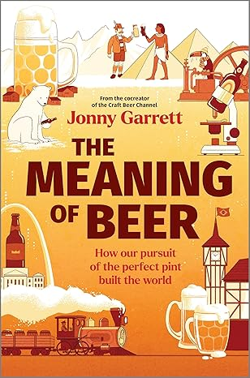

import YouTubeEmbed from '../../src/components/YouTubeEmbed';

## The Meaning of Beer
Jonny Garret

### Description 
(The following is stolen from Amazon)

*__Jonny Garrett, cofounder of the YouTube sensation Craft Beer Channel, travels in search of the deeper cultural impact of brewing—how it has become one of the world’s most important inventions and shaped our lives for millennia.__*

*What’s the oldest and most consumed alcoholic beverage on earth? Beer, of course. And it might just be one of our more important inventions.*

*Since its creation thirteen thousand years ago, our love of beer has shaped everything from religious ceremonies to advertising, and architecture to bioengineering. The people who built the pyramids were paid in ale; the first fridge was built for beer, not food; bacteria was discovered while investigating sour beer; Germany’s beer halls hosted Hitler’s rise to power; and brewer’s yeast may yet be the answer to climate change.*

*In The Meaning of Beer, award-winning beer writer Jonny Garrett tells the stories of these incredible human moments and inventions, taking readers to some of the best-known beer destinations in the world—Munich and Oktoberfest, Carlsberg Brewery’s historic laboratory, St. Louis and the home of Budweiser—as well as those lesser known, from a five-thousand-year-old brewery in the Egyptian desert to Arctic Svalbard, home to the world’s most northerly pub.*

*Ultimately, this is not a book about how we made beer, but how beer made us.*

- __The Craft Beer Channel:__ *How beer built the world*
<YouTubeEmbed URL="https://www.youtube.com/embed/rVAdqEZrrE8" />